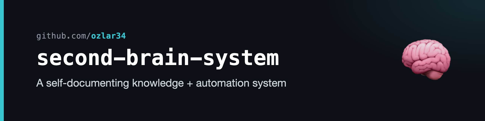
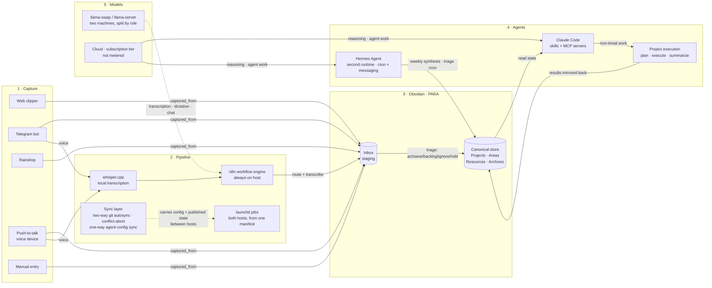

# second-brain-system

A designed, self-documenting personal knowledge and automation system. Obsidian
is the single canonical store; Claude Code and a second agent runtime (Hermes
Agent) are the activation layer; local models are the offline/private tier; and
a set of deterministic drift tripwires plus an explicit memory lifecycle keep
the whole thing from silently rotting.

This repo is a **case study, not a vault mirror.** It is a portfolio snapshot,
re-cut from the private architecture note at milestones, using fully synthetic
examples. There is no real personal content here. The point is the architecture
and the decisions behind it.

*Last verified: 2026-08-26.*

## The 30-second model

Capture surfaces drop raw material into an inbox. A pipeline routes and
transcribes it. Obsidian holds the truth: every decision, project state, and
durable note lives there. Claude Code plus a lightweight project-execution
framework is the engine that reads that state, does the work, and writes results
back; a second agent runtime handles the unattended, scheduled work. Local models
cover what must stay on-device.

In one line: **capture flows in, the pipeline routes it, Obsidian holds the
truth, the agents do the work, local models cover the offline/private tier.**

## Architecture

Five logical groups, left to right. Solid edges are the flow of material; dotted
edges are infrastructure. Cloud models do the reasoning and agent work; local
models do the work that must not leave the house.

## Design decisions

The interesting part of a system like this is not the feature list, it is the
constraints it was designed around. Three decisions shape everything else.

### One canonical store

Working files live in a few places (a code-projects folder, a tooling folder),
but **state and reasoning live in exactly one place: the vault.** Every other
surface is treated as derived or disposable. The payoff is that there is never a
question of "where is the real version" — context, decisions, and project state
have a single home, and every automation reads and writes through it. The cost
is discipline: things that want to sprawl across tools have to be pulled back to
the canonical store, deliberately.

### Subscription, not metered (the invariant behind the model layer)

Every model this system depends on is either a **flat subscription** or
**local**. There is no API key handed to a cron job and no per-token bill
anywhere in the standing automation. The invariant is *no metered spend*, not
*no cloud*: an unattended job may call a cloud model as long as the call rides a
subscription.

That reframes what the local stack is for. It started as the cost tier — "the
only thing that can run without a human in the loop" — and for a while the
unattended crons ran on local models because of it. Once the second agent
runtime could reach a subscription-tier cloud model headlessly, the crons moved
there, and the local models settled into the role they are actually good at:
the **offline/private tier**. Transcription, dictation, and anything that must
not leave the house run on local llama-swap / llama-server across two machines;
reasoning and agent work go to subscription cloud models. The line is drawn by
privacy and by what runs unattended, not by cost.

### Drift tripwires as guardrails

A personal system that nobody audits rots. This one has **deterministic drift
detection built in** so it does not have to rely on me noticing.

- **Hygiene scanners** run as plain scripts (no LLM in the loop) and return a
  `HOT / WARM / COOL` status written to a hygiene report. One checks the vault,
  one checks the tooling layer. A monthly deep sweep escalates when either goes
  `HOT`.
- **Growth caps:** long-lived hub notes carry a line-count cap in frontmatter;
  the scanner flags any note over its cap, warns at 80%, and a dated rotation
  script moves overflow into the archive — human-triggered, never on cron.
- **Semantic pass (`/dream`):** a manual, roughly monthly LLM sweep for the rot
  the scripts are blind to — a note asserting as current something a newer
  source has flipped. Propose-only: it writes findings to a proposals file and
  never edits a source note.
- **Edit-triggered reconcile (`/vault-reconcile`):** the tight-loop complement.
  It diffs the vault's git snapshot since the last run and flags a recent edit
  that silently contradicts older lines *in the same note*. Trigger is an edit,
  not the calendar. Both passes are kept on purpose: they differ on trigger and
  latency, not on job.
- **Scheduler ↔ map check:** a script reconciles the scheduled jobs actually
  installed on each host against a tracked manifest, and flags any job running
  on a host its row excludes — the class of drift where a job quietly keeps
  running on the machine it was migrated *away* from.
- **Memory-compounding guards:** a canonical-files manifest (a missing or
  trashed anchor note is `HOT`), cap pressure on capped logs, and an
  infra-retirement check that snapshots registered hooks and skills and flags
  any that vanish between runs.

The reason these are deterministic scripts and not "ask the model to check" is
the same reason the metadata enums are closed (see
[CONVENTIONS.md](CONVENTIONS.md)): a closed, structured schema is something a
cheap script can verify with certainty, every time, for free.

#### Memory lifecycle (T0–T3)

Knowledge should compound — repeated learnings climb — rather than merely
accumulate. The harness treats memory as four tiers, each with its own decay
rule:

| Tier | What | Decay / rent |
|---|---|---|
| **T0 ephemeral** | transcripts, session handoffs | auto-expire |
| **T1 capture** | dated learning queues, filled by a read-only session-end distiller | drained weekly; unrepeated entries age out (demotion, not deletion) |
| **T2 curated** | area hubs, tool notes | current-state claims carry a date stamp; a stamp over a quarter old is re-verified or demoted |
| **T3 resident** | always-loaded instruction lines | each line must cite a recent incident or lose its seat at every prune |

Promotion needs repetition (`seen ≥ 2` for T1→T2; multiple incidents across
sessions plus a cost statement for T3). No LLM sits in a destructive path:
placement is deterministic, the writer never deletes or reorders, and
adjudication is human and batched into the weekly review.

## The layers

**Capture.** Everything inbound lands in a staging inbox carrying a
`captured_from` tag (web clipper, Telegram, Raindrop, a push-to-talk voice
device, or manual). The inbox is staging, never a destination. Triage runs in
three modes — an unattended *propose* pass that stages verdicts and pushes an
action list to Telegram, a *review* pass that applies them, and a bounded
interactive walkthrough — and every item gets one of five verdicts: act, save,
backlog, ignore, hold.

**Pipeline.** Two hosts, one shared spine. An always-on mini server runs n8n,
Postgres, whisper.cpp transcription, and the second agent runtime; a laptop runs
the jobs that need its local files. Every scheduled job on either host is
generated from **one tracked manifest** rather than hand-maintained on disk, and
the drift check reads that manifest. The judgment crons (weekly synthesis, inbox
triage) were re-homed to the always-on host so they run while the laptop sleeps
— **exactly one machine writes the vault on a schedule.** A sync layer holds it
together: two-way git autosync for the working repos (conflict = abort and
alert, never auto-resolve), a one-way sync for the agent-config tree (the laptop
authors, the server consumes; host-specific settings deliberately excluded), and
a published-state file so a job on the server can reason about the laptop
without reaching it. Every vault-touching surface resolves its paths through one
shared config file, so the folder layout has a single source of truth.

**Obsidian + PARA.** The vault is organized by PARA (Projects, Areas, Resources,
Archives) for how knowledge *rests*, with a handful of `_`-prefixed meta-folders
for the things PARA does not cover: live state, tooling, templates, and capture
staging. Every note is typed by a closed `note_type` enum. Details in
[CONVENTIONS.md](CONVENTIONS.md).

**Agents — Claude Code + GSD, and Hermes Agent.** Claude Code is the primary
activation engine: a library of roughly 80–100 skills (slash-command workflows)
handles recurring work, and MCP servers connect the external systems — TickTick,
Notion, Gmail, Calendar, n8n, Gemini, Raindrop. Anything non-trivial routes into
a small project-execution framework (GSD) that keeps a `.planning/` directory per
project: a plan, a roadmap, a state file, and per-phase plan/summary documents.
Plans get executed atomically and summarized; the output is mirrored back into
the vault. **Hermes Agent** is the second runtime: a self-improving agent with
its own skills, persistent memory, messaging gateways, and cron triggers. It owns
the unattended work — the weekly synthesis and the triage cron — and the
push-to-talk voice capture lane. The two compose rather than compete: Claude Code
is what a person sits in front of; Hermes is what runs while nobody is looking.

**Models.** Two machines run llama-swap / llama-server, split by role: a laptop
for interactive, on-demand work (localhost only), and the always-on server for
the automations (private network). The routing rule: privacy-bound and offline
work — transcription, dictation, local chat — runs on local models; multi-step
reasoning and agent work go to subscription-tier cloud models.

## Evolution

Dated turns in the design, most recent last. Each is a change that crossed a
layer boundary, which is the trigger for re-cutting this snapshot.

| Date | Change | Why |
|---|---|---|
| 2026-06-10 | `note_type` enum grew from 7 to 13 values; capture-output folders (People, Meetings, Summaries) added | The vault started holding structured capture output, not just notes |
| 2026-06-19 | Ollama replaced by llama-swap / llama-server on both machines | Explicit model pools, per-model flags, and swap-on-demand instead of an opaque daemon |
| 2026-06-22 | Hermes Agent became load-bearing as the second runtime | The unattended vault crons moved onto it on the always-on host, establishing the sole-writer rule |
| 2026-07-26 | Daily Brief retired | The generated morning digest wasn't being read and cost a full agent call per run; the weekly synthesis is the surviving rollup |
| 2026-07-27 | Cross-host published state | Lets a job on the server reason about the laptop without reaching it — carried out-of-band from the vault sync whose staleness it detects |
| 2026-08-23 | Push-to-talk voice capture lane | A dedicated voice device feeds the inbox through the second runtime |
| 2026-08-25 | Hermes moved from local models to the subscription cloud tier | The local pool had no production consumer the subscription tier didn't serve better; the local stack became the offline/private tier by design, not the cost tier |
| 2026-08-26 | Scheduled jobs generated from one tracked manifest | Two hosts with different job sets, users, and timezones can't share a checked-in plist; the manifest is now authoritative and the drift check reads it |

## Conventions

The transferable design contract — the `note_type` enum, the frontmatter shape,
the PARA mapping, and the capture-to-triage flow — is written up in
[CONVENTIONS.md](CONVENTIONS.md). It is deliberately generic so a reader could
adopt the same structure. The drift tripwires mean the system stays honest for
whoever is running it, not just the original author.

## Prior art

The "second brain" framing and the PARA structure both come from Tiago Forte's
[*Building a Second Brain*](https://www.buildingasecondbrain.com/) (2022), which
is where this started. PARA — Projects, Areas, Resources, Archives — is his
method for organizing knowledge by how actionable it is; this system adopts it
wholesale for how notes *rest* (see [CONVENTIONS.md](CONVENTIONS.md)).

What's layered on top is the part that isn't in the book: the activation engine.
Forte's method is about how a knowledge base is *organized*; this repo is about
how one is *run* — the capture pipeline, the two agent runtimes that read and
write the vault, the model routing, and the deterministic drift tripwires that
keep it from rotting. The methodology is borrowed; the system built around it is
the original work.

## Examples

[`examples/`](examples/) holds four **fully synthetic** notes that show the
conventions in practice. The content is invented; the shape is real — the
frontmatter is regenerated from the live templates.

- [`area-coffee.md`](examples/area-coffee.md) — a life-area hub that indexes its
  domain and links its resources, with a growth cap.
- [`resource-pour-over-dial-in.md`](examples/resource-pour-over-dial-in.md) — a
  durable single-idea note, with provenance and the auto-appended backlink to
  its area.
- [`project-home-server.md`](examples/project-home-server.md) — an active project
  note with status and next actions.
- [`weekly-synthesis-2026-W03.md`](examples/weekly-synthesis-2026-W03.md) — a
  cron-drafted weekly synthesis, the rollup the weekly review finalizes.

## Components — the system running

This case study describes the design. These public repos are pieces of it
running in the real world:

- **[claude-code-skills](https://github.com/ozlar34/claude-code-skills)** — the
  skills and slash-command layer (Layer 4).
- **[job-match-radar](https://github.com/ozlar34/job-match-radar)** — a workflow
  engine plus database automation example (Layer 2).
- **[dictation-vibecode-tuning](https://github.com/ozlar34/dictation-vibecode-tuning)**
  — local-model dictation tuning (Layer 5).
- **[Sidekick](https://github.com/ozlar34/Sidekick)** — a native macOS capture
  surface (Layer 1).
- **[StanzaApp](https://github.com/ozlar34/StanzaApp)** — a native macOS menu-bar
  utility.
