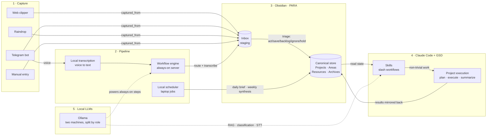

# second-brain-system

A designed, self-documenting personal knowledge and automation system. Obsidian
is the single canonical store, Claude Code plus local LLMs are the activation
layer, and a set of deterministic drift tripwires keep the whole thing from
silently rotting.

This repo is a **case study, not a vault mirror.** It documents how the system is
designed and why, using fully synthetic examples. There is no real personal
content here. The point is the architecture and the decisions behind it.

## The 30-second model

Capture surfaces drop raw material into an inbox. A pipeline routes and
transcribes it. Obsidian holds the truth: every decision, project state, and
durable note lives there. Claude Code plus a lightweight project-execution
framework is the engine that reads that state, does the work, and writes results
back. Local LLMs run the always-on, cheap, privacy-bound work that does not need
to call out to the cloud.

In one line: **capture flows in, the pipeline routes it, Obsidian holds the
truth, Claude does the work, local LLMs power the cheap automation.**

## Architecture

Five logical groups, left to right. The solid edges are the flow of material;
the dotted edges are where local models quietly power the cheap, always-on work
so the cloud model is reserved for reasoning.

## Design decisions

The interesting part of a system like this is not the feature list, it is the
constraints it was designed around. Three decisions shape everything else.

### One canonical store

Working files live in a few places (a code-projects folder, a tooling folder),
but **state and reasoning live in exactly one place: the vault.** Every other
surface is treated as derived or disposable. The payoff is that there is never a
question of "where is the real version" — context, decisions, and project state
have a single home, and every automation reads and writes through it. The cost
is discipline: things that want to sprawl across tools have to be pulled back to
the canonical store, deliberately.

### The no-API-key constraint (why the local stack exists)

Cloud Claude here is a **subscription, not a raw API key.** There is no
`ANTHROPIC_API_KEY` to hand to a cron job. That single fact has a large
structural consequence: any unattended automation that needs an LLM *cannot* call
the cloud model headlessly. It has to run a local model.

So the local LLM stack is not a nice-to-have, it is **load-bearing.** The
always-on work — transcription, classification, retrieval over notes, cheap
inline tasks — runs on local Ollama because that is the only thing that can run
without a human in the loop. The expensive, multi-step reasoning runs
interactively through Claude Code. The constraint draws a clean line between
"what runs unattended" and "what a person sits in front of," and the whole local
stack is the answer to it.

### Drift tripwires as guardrails

A personal system that nobody audits rots. This one has **deterministic drift
detection built in** so it does not have to rely on me noticing.

- **Hygiene scanners** run as plain scripts (no LLM in the loop) and return a
  simple `HOT / WARM / COOL` status written to a hygiene report. One checks the
  vault, one checks the tooling layer.
- **Growth caps:** long-lived hub notes carry a line-count cap in frontmatter;
  the scanner flags any note that outgrows its cap, so files get split before
  they bloat.
- **Monthly deep sweep:** a heavier audit runs on a cadence — a full vault scan
  plus tooling and install hygiene — and the day-to-day scanners escalate into
  it when one of them goes `HOT`.

The reason these are deterministic scripts and not "ask the model to check" is
the same reason the metadata enums are closed (see
[CONVENTIONS.md](CONVENTIONS.md)): a closed, structured schema is something a
cheap script can verify with certainty, every time, for free.

## The layers

**Capture.** Everything inbound lands in a staging inbox carrying a
`captured_from` tag (web clipper, Telegram, Raindrop, or manual). The inbox is
staging, never a destination. A bounded triage pass gives each item a fit-scan
and one of five verdicts — act, save, backlog, ignore, hold — and walks long
inboxes in small batches rather than one exhausting sitting.

**Pipeline.** Two hosts, one shared spine. An always-on server runs the workflow
engine, the database, and local transcription. A laptop-side scheduler runs the
jobs that need local files — the daily brief, the weekly synthesis. Every
vault-touching surface resolves its paths through one shared config file instead
of hard-coding them, so the folder layout has a single source of truth.

**Obsidian + PARA.** The vault is organized by PARA (Projects, Areas, Resources,
Archives) for how knowledge *rests*, with a handful of `_`-prefixed meta-folders
for the things PARA does not cover: live state, tooling, templates, and capture
staging. Every note is typed by a closed `note_type` enum. Details in
[CONVENTIONS.md](CONVENTIONS.md).

**Claude Code + GSD.** Claude Code is the activation engine. A library of skills
(slash-command workflows) handles recurring work — daily briefs, triage,
logging — reading and writing the vault through the shared path config. Anything
non-trivial routes into a small project-execution framework (GSD) that keeps a
`.planning/` directory per project: a plan, a roadmap, a state file, and per-phase
plan/summary documents. Plans get executed atomically and summarized; the output
is mirrored back into the vault.

**Local LLMs.** Two machines run local models, split by role: a laptop for
interactive, on-demand heavy work, and an always-on server for the unattended
automations. The routing rule is simple — speed-bound, privacy-bound, always-on,
zero-per-token work runs local; multi-step reasoning and agent work goes to the
cloud model.

## Conventions

The transferable design contract — the `note_type` enum, the frontmatter shape,
the PARA mapping, and the capture-to-triage flow — is written up in
[CONVENTIONS.md](CONVENTIONS.md). It is deliberately generic so a reader could
adopt the same structure. The drift tripwires mean the system stays honest for
whoever is running it, not just the original author.

## Prior art

The "second brain" framing and the PARA structure both come from Tiago Forte's
[*Building a Second Brain*](https://www.buildingasecondbrain.com/) (2022), which
is where this started. PARA — Projects, Areas, Resources, Archives — is his
method for organizing knowledge by how actionable it is; this system adopts it
wholesale for how notes *rest* (see [CONVENTIONS.md](CONVENTIONS.md)).

What's layered on top is the part that isn't in the book: the activation engine.
Forte's method is about how a knowledge base is *organized*; this repo is about
how one is *run* — the capture pipeline, the Claude Code plus local-LLM
automation that reads and writes the vault, and the deterministic drift
tripwires that keep it from rotting. The methodology is borrowed; the system
built around it is the original work.

## Examples

[`examples/`](examples/) holds four **fully synthetic** notes that show the
conventions in practice. The content is invented; the shape is real.

- [`area-coffee.md`](examples/area-coffee.md) — a life-area hub that indexes its
  domain and links its resources.
- [`resource-pour-over-dial-in.md`](examples/resource-pour-over-dial-in.md) — a
  durable single-idea note, with the auto-appended backlink to its area.
- [`project-home-server.md`](examples/project-home-server.md) — an active project
  note with status and next actions.
- [`daily-brief-2026-01-15.md`](examples/daily-brief-2026-01-15.md) — a generated
  daily activation brief.

## Components — the system running

This case study describes the design. These public repos are pieces of it
running in the real world:

- **[claude-code-skills](https://github.com/ozlar34/claude-code-skills)** — the
  skills and slash-command layer (Layer 4).
- **[job-match-radar](https://github.com/ozlar34/job-match-radar)** — a workflow
  engine plus database automation example (Layer 2).
- **[dictation-vibecode-tuning](https://github.com/ozlar34/dictation-vibecode-tuning)**
  — local-LLM dictation tuning (Layer 5).
- **[Sidekick](https://github.com/ozlar34/Sidekick)** — a native macOS capture
  surface (Layer 1).
- **[StanzaApp](https://github.com/ozlar34/StanzaApp)** — a native macOS menu-bar
  utility.

## Roadmap

A sanitized, public demo of the private dashboard app is the next phase. See
[ROADMAP.md](ROADMAP.md).
